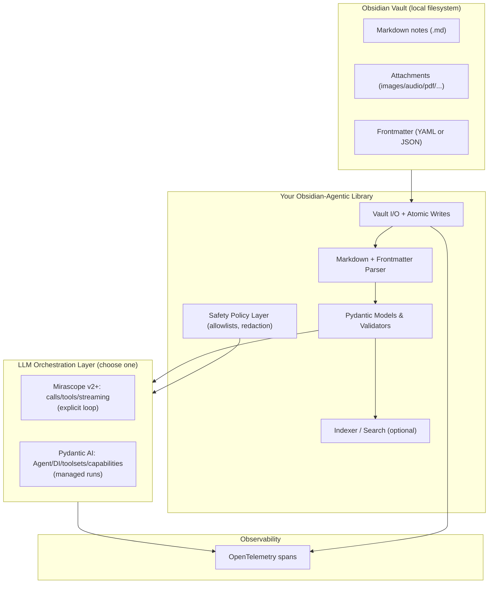
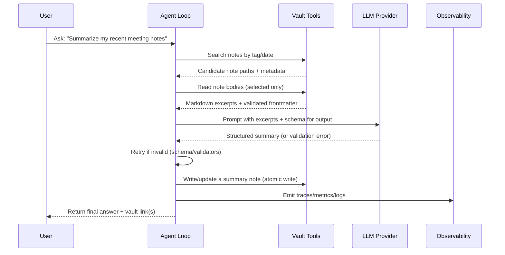

# Deep Comparative Report: Mirascope v2+ vs Pydantic AI for a Personal Agentic Library Interacting with an Obsidian Vault

## Executive summary

Both Mirascope (v2+) and Pydantic AI are modern, type-forward Python libraries aimed at building reliable LLM-powered systems, and both lean heavily on Pydantic for schema/typing-driven behavior rather than inventing a wholly separate “DSL” for AI work. The decisive difference is *where the abstraction boundary sits*: Mirascope is primarily a “typed LLM SDK” centered on provider-agnostic calls, tools, streaming, and structured parsing; Pydantic AI is a fuller “agent framework” centered on an `Agent` container with dependency injection, toolsets/capabilities (extension points), run/stream orchestration, systematic testing primitives, and first-class observability integration via OpenTelemetry. 

For an Obsidian-vault personal agentic library (local Markdown + YAML/JSON frontmatter + attachments), the core engineering work is *not* the LLM wrapper; it is a robust vault I/O layer: frontmatter parsing/validation, atomic writes, conflict handling with a concurrently-open Obsidian app, indexing/search over many `.md` files, and safe tool boundaries that prevent unintended exfiltration of private notes. Obsidian stores properties in YAML at the top of a Markdown note, and defines frontmatter as YAML or JSON; attachments are regular files in the vault and can be stored in configurable locations. 

A practical recommendation pattern for personal agentic Obsidian tooling is:

- Choose **Pydantic AI** if you want a long-lived “agent platform” feel: dependency injection as a first-class pattern, composable capability/toolset extension points, concurrency limiting, durable/human-in-the-loop flows, strong testing story (notably `TestModel`/`FunctionModel` and override hooks), and OpenTelemetry-compatible observability built-in. 
- Choose **Mirascope v2+** if you want an “LLM anti-framework” / typed SDK feel with explicit control: you write ordinary Python functions decorated as calls/tools, you own the outer orchestration loop, and you want a tight, provider-agnostic interface for calls/tools/streaming/structured parsing plus OpenTelemetry-based tracing via its ops module. 

Both projects currently require Python ≥ 3.10, so if your runtime is older you should treat that as a hard constraint up front. 

## Project background, governance, licensing, release cadence

### Mirascope v2+ background and purpose

Mirascope positions itself as “Every frontier LLM. One unified interface,” and the Python package description frames it as an “LLM Anti‑Framework” and “Goldilocks API” that aims to balance raw provider control with type safety and ergonomics. 
The repository README describes a monorepo split across `python/`, `typescript/`, `website/`, and unified docs, and explicitly states it uses Semantic Versioning. 

Maintainer/authorship is listed on the Python package registry as entity["people","William Bakst","mirascope maintainer"] (author and maintainer). 

Licensing is MIT (copyright notice “Mirascope, Inc.”). entity["company","Mirascope, Inc.","ai tooling company"] 

Release cadence (recent) is relatively fast. From the package release history: v2.0.0 (Jan 21, 2026) through v2.4.0 (Mar 8, 2026) includes many minor/patch releases clustered within weeks (e.g., 2.0.0 → 2.0.2 over 3 days; multiple releases early Feb; then Feb 27 and Mar 8).  
A notable recent breaking change: Mirascope Cloud was discontinued and cloud-backend modules were removed so the project is “a pure LLM SDK” moving forward. 


### Pydantic AI background and purpose

Pydantic AI describes itself as a “GenAI Agent Framework, the Pydantic way,” and its README explains its origin story: the maintainers wanted a “FastAPI feeling” for GenAI/agent building after using LLMs within Logfire and not finding an equivalent ergonomic framework. 
The project is owned by “Pydantic” on the package registry; the author is entity["people","Samuel Colvin","pydantic creator"] and maintainers include accounts listed on the registry. 
Its license is MIT with copyright attributed to entity["company","Pydantic Services Inc.","pydantic maintainers"]. 

Release cadence is extremely high as of early April 2026: the Python package shows releases on Apr 8 (1.78.0), Apr 3 (1.77.0), Apr 2 (1.76.0), Apr 1 (1.75.0), Mar 31 (1.74.0), and multiple additional releases in March. 
Crucially for long-term maintainability, Pydantic AI’s Upgrade Guide states that reaching v1 in September 2025 implies a commitment to API stability until v2 (no breaking changes until then, per their policy). 

### Practical note on Python version and packaging

Both projects require Python ≥ 3.10 according to their package metadata. 
Both use MIT licensing, which is generally low-risk for personal use; the main legal risk tends to come from the terms of service for any LLM providers you call, and from how you handle personal/private data from your vault in prompts or telemetry. 

## Architecture and core concepts

### Mirascope v2+ architecture: typed calls, explicit orchestration

Mirascope’s v2 docs organize the `mirascope.llm` module around core concepts: messages, models, responses, prompts, calls, tools, structured output, streaming, async, agents, context/chaining, errors, reliability, providers, local models, and MCP integration. 

The primary “shape” is: you define functions decorated with `@llm.call` (or build a `Model` and call/stream directly), optionally attach tools, then handle tool calls and multi-turn continuation explicitly by calling `execute_tools()` and `resume()` in a loop until no tool calls remain. 

Structured output is expressed with a `format=` parameter (supporting primitives, collections, and Pydantic `BaseModel`), then parsed via `response.parse()`; parse failures raise `llm.ParseError`, and the framework provides both manual retry via `retry_message()` and a convenience `validate()` method that automatically retries parse/validation failures. 

Async support is positioned as a performance/concurrency tool, especially for parallel LLM calls and I/O-heavy tools, and tool execution for async tools is explicitly described as concurrent via `asyncio.gather`. 
Error handling is normalized through a unified exception hierarchy (`llm.Error` base, provider/request/tool/parse subclasses).   
Provider routing is implemented via a provider registry using prefix-matching of model IDs (e.g., `anthropic/...`, `openai/...`), and you can customize routing/config via `llm.register_provider()`. 
Reliability is provided via `@llm.retry` / `retry_model` with exponential backoff, configurable retry predicates, and fallback model lists. 

Observability is provided by the `ops` module built on entity["organization","OpenTelemetry","observability framework"]. It requires explicit configuration of the tracer provider/exporter (i.e., there is no “silent default export”), and can export to any OTEL-compatible backend. 

### Pydantic AI architecture: agent container + DI + toolsets/capabilities

Pydantic AI’s central abstraction is `Agent`: conceptually a container for developer instructions, function tools/toolsets, an optional structured output type, and a dependency type constraint used by instructions/tools/validators. citeturn7view13turn15view4  
Agents can be run async (`run`) or sync (`run_sync`), and support streaming variants. citeturn15view2turn15view4

Dependency injection is a first-class system: dependencies “can be any python type,” commonly packaged into dataclasses, and are accessible through `RunContext` in system prompts/tools/output validators. citeturn7view7turn21view2  
Models/providers are abstracted: “Model” classes wrap vendor SDKs behind a vendor-agnostic API; “Provider” classes handle auth/endpoints; swapping the agent’s model should allow portability across vendors. citeturn7view9

Extensibility is centered on **capabilities**, which bundle tools/toolsets, lifecycle hooks, instructions, and model settings; the docs describe them as the “primary extension point.” citeturn7view8turn21view2  
Toolsets are a further structuring mechanism (including custom toolsets via an abstract base class) and can be supplied at agent construction time or per-run. citeturn7view12turn7view8  
Tools have advanced controls such as custom argument validators that run after schema validation but before execution, and can trigger model retries by raising `ModelRetry`. citeturn7view10turn16search27

Validation failures (tool argument validation and structured output validation) can be reflected back to the model as retry prompts; Pydantic AI also explicitly documents the ability to raise `ModelRetry` from tools/output validators/capability hooks. citeturn15view4turn16search27turn16search7

Concurrency is explicit: you can set agent-level `max_concurrency`, and create shared concurrency limiters across multiple models/agents. citeturn15view0turn19view1  
Usage limiting is first-class via `UsageLimits` for tokens/requests/tool calls, which is relevant for preventing infinite tool loops in long-running agents. citeturn15view1turn15view2turn15view0

Observability: Pydantic AI integrates with Logfire instrumentation, states it uses OpenTelemetry, and can send traces to any OTEL backend; with instrumentation enabled, traces include messages, tool calls, token usage, latency, and errors. citeturn7view6turn7view13turn21view2

### Architecture diagrams





## Feature comparison and developer experience

### Feature-by-feature comparison table

The table below emphasizes *framework-level behavior* (what you get beyond “raw Pydantic”), since both projects ultimately rely on Pydantic for schema definition, JSON Schema generation, and serialization primitives. citeturn16search0turn16search1turn10view0turn15view4

| Capability area | Mirascope (v2+) | Pydantic AI |
|---|---|---|
| Primary purpose | Typed, provider-agnostic LLM SDK: calls, tools, structured parsing, streaming, retries; you own the outer orchestration loop. citeturn9view0turn9view1turn7view3 | Agent framework: `Agent` as container for instructions/tools/toolsets/output types/deps, plus orchestration, concurrency/usage limits, extensibility via capabilities/toolsets. citeturn7view13turn7view8turn7view12 |
| Data models & validation | Structured output via `format=` + Pydantic `BaseModel`; parse via `response.parse()`, validation retry via `response.validate()`. citeturn10view0 | Structured output via `output_type` plus output validation; invalid outputs and tool arg validation errors can be returned to model for retry; `ModelRetry` is an explicit mechanism. citeturn15view4turn16search27turn21view2 |
| Parsing/serialization primitives | Leans on Pydantic types but expresses “expected output type” as `format=...` on calls/models; parsing is mediated by response objects. citeturn10view0turn9view0 | Leans on Pydantic/Pydantic-core; output schema flows through agent’s structured output types and tool schemas. citeturn15view4turn21view2 |
| JSON Schema generation | Inherits Pydantic’s JSON Schema capabilities (models/types adapt), used implicitly for tool schemas and structured output constraints. citeturn10view0turn16search0 | Same; explicitly exposes structured dict schema patterns and output validators; tool arg schema generation is foundational. citeturn16search7turn21view2 |
| Type inference & typing support | Type hints + docstrings power tool schema; docs highlight supported primitives and Pydantic models for structured output. citeturn9view1turn10view0 | “Fully Type-safe” is an explicit product claim; examples emphasize static type checking catching wrong annotations, and agent generic types. citeturn21view2turn7view13 |
| Runtime behavior | Explicit, composable building blocks (`@llm.call`, `@llm.tool`, stream objects). The agent “pattern” is a simple while-loop with `execute_tools()` and `resume()`. citeturn9view1turn7view3 | Managed run loop within `Agent` including streaming/graph iteration options; built-in usage limits/concurrency limits help prevent runaway behavior. citeturn15view2turn15view1turn15view0turn7view13 |
| Async + concurrency | Async guidance provided; async tool execution uses `asyncio.gather`; async becomes mandatory if any tool is async (per docs). citeturn9view1turn7view1 | Async-first (`run`) plus sync wrapper (`run_sync`); explicit `max_concurrency`, shared concurrency limiters, and instrumentation visibility of queued waits. citeturn15view2turn15view0turn19view1 |
| Error handling | Unified exception hierarchy with provider-normalized errors, parse errors, tool errors, retries exhausted, etc. citeturn7view2 | Model/tool/output failures are modeled; supports retry control flow via `ModelRetry`; fallback/error-group patterns exist in model layer docs. citeturn16search27turn19view1 |
| Reliability & retries | First-class `@llm.retry` decorator with backoff/jitter, retry-on exception sets, and fallback model lists; parse-validation retries via `validate()`. citeturn10view2turn10view0 | Multiple layers: output/tool retries, usage limits to cap loops; model-level fallback patterns and explicit exception-handling are documented. citeturn15view1turn15view2turn19view1 |
| Observability/logging | `ops` module is OpenTelemetry-based and must be configured with a tracer provider/exporter; supports OTEL backends. citeturn9view6 | “Seamless Observability” is a core claim; OpenTelemetry-based instrumentation with Logfire integration, also compatible with other OTEL backends. citeturn7view6turn21view2 |
| Debugging tools | Streaming “pretty” modes and tool call visibility; `ops` spans/sessions/versioning concepts in docs. citeturn9view2turn9view6turn20search2 | Tracing docs describe visibility into messages, tool calls, token usage, latency, errors; evals/testing ecosystem is emphasized. citeturn7view13turn7view6turn21view2turn21view1 |
| Developer ergonomics | “Goldilocks”/anti-framework messaging; decorators provide a smooth “write normal Python” feel. citeturn14view0turn12view3turn9view0 | Explicitly aims for “FastAPI feeling” and highlights type safety, capabilities/toolsets, durable execution, human approval flows. citeturn21view2turn7view8turn7view11 |
| IDE integration | Indirect: type hints + Pydantic models improve autocomplete/linters; no special IDE layer is required. citeturn10view0turn12view3 | Directly claimed as a design goal (“Designed to give your IDE… as much context as possible”). citeturn21view2 |
| Extension points | Provider registry (`register_provider`), strict tools, provider-native tools (e.g., web search), custom output parsers (format option), OpenTelemetry ops hooks. citeturn10view1turn9view1turn6search4turn9view6 | Capability system as “primary extension point”; toolsets (incl. custom toolsets), hooks, deferred tools/approval, custom validators. citeturn7view8turn7view12turn7view10turn7view11 |
| Performance/memory considerations | Framework overhead is modest; real cost is provider latency + any vault indexing. Parsing/validation retries can add additional LLM calls. citeturn10view0turn10view2 | Similar; framework adds agent orchestration features. Concurrency/usage limiting can prevent runaway cost. Instrumentation can add overhead if enabled. citeturn15view0turn15view1turn7view6 |

## Obsidian vault integration and a recommended architecture

### What “Obsidian vault integration” concretely means

Obsidian notes are Markdown `.md` files; note “properties” are stored as YAML at the top of the file, and “frontmatter” is defined as YAML or JSON at the top of the note. citeturn17view1turn17view2turn17view5  
Attachments (images, audio, PDFs, etc.) are regular files in the vault; Obsidian can create/copy them into a default attachment folder whose location is configurable (root, same folder, specified folder, etc.). citeturn17view0turn17view1  
Large-vault scalability is less about “LLM framework choice” and more about how you index/read files. Even Obsidian’s own “file backlinks” property is explicitly described as performance heavy in its Bases feature, which is a useful cautionary signal for any external full-vault scanning. citeturn17view3

### Recommended integration architecture for an Obsidian-interacting agent library

A durable pattern is a three-layer design:

- **Vault layer (deterministic, non-LLM):** file discovery, frontmatter parsing, markdown segmentation, attachment handling, atomic read-modify-write, change detection, and indexing/search. This layer should be independently testable without any LLM calls. citeturn17view2turn17view0turn17view1  
- **Schema layer (Pydantic):** strongly typed frontmatter models, typed “note snapshots,” and typed “edit plans” that you can validate before writing. Pydantic supports JSON Schema generation and flexible serialization/dumping. citeturn16search0turn16search1turn16search17  
- **Agent layer (LLM):** exposes *narrow* tools to the model such as `search_notes`, `read_note_excerpt`, `write_note_patch`, with safe defaults and explicit policy constraints. This is where you choose Mirascope or Pydantic AI. citeturn9view1turn7view13turn7view11

Obsidian also provides an official CLI (requires the Obsidian app running) which you might optionally use for certain UI-coordinated workflows, but a vault-first library typically interacts directly with the filesystem for independence and reproducibility. citeturn17view4turn17view0

### Concrete implementation examples

The following examples focus on the “vault layer + schema layer,” then show two alternative agent loops (one per library). The parsing/writing logic is intentionally framework-agnostic so it can be reused.

#### Models: frontmatter schemas and note snapshots (Pydantic v2-style)

```python
from __future__ import annotations

from datetime import date, datetime
from pathlib import Path
from typing import Any, Literal

from pydantic import BaseModel, Field, field_validator


class ObsidianFrontmatter(BaseModel):
    # Common Obsidian properties; adjust to your conventions
    title: str | None = None
    tags: list[str] = Field(default_factory=list)
    aliases: list[str] = Field(default_factory=list)
    created: date | None = None
    updated: datetime | None = None

    # Example: enforce normalized, unique tags
    @field_validator("tags", mode="after")
    @classmethod
    def tags_unique(cls, v: list[str]) -> list[str]:
        seen: set[str] = set()
        out: list[str] = []
        for t in v:
            t2 = t.strip()
            if not t2:
                continue
            if t2 not in seen:
                seen.add(t2)
                out.append(t2)
        return out


class NoteSnapshot(BaseModel):
    path: Path
    frontmatter: ObsidianFrontmatter
    body: str
    # Optional computed fields
    sha256: str | None = None


class NotePatch(BaseModel):
    # Minimal patch model: update frontmatter fields and/or replace body
    frontmatter_updates: dict[str, Any] = Field(default_factory=dict)
    body_mode: Literal["keep", "replace"] = "keep"
    body_replacement: str | None = None
```

Pydantic supports JSON Schema generation (`model_json_schema`) and structured serialization/dumping, which is useful for “edit-plan” objects you want to validate and persist. citeturn16search0turn16search1turn16search17  
This pattern matches Obsidian’s “properties in YAML at the top of the file,” with your schema enforcing conventions (types, uniqueness, formats). citeturn17view2turn17view5

#### Parse Markdown + YAML/JSON frontmatter

```python
from __future__ import annotations

import hashlib
import json
import os
import tempfile
from dataclasses import dataclass
from pathlib import Path
from typing import Any, Tuple

# Choose one YAML library; ruamel.yaml is best for round-tripping formatting,
# PyYAML is simplest. This example uses PyYAML-style API.
import yaml  # type: ignore


FRONTMATTER_DELIM = "---"


def _sha256_bytes(data: bytes) -> str:
    return hashlib.sha256(data).hexdigest()


def split_frontmatter(text: str) -> tuple[dict[str, Any], str, str]:
    """
    Returns (frontmatter_dict, body, format), where format is "yaml", "json", or "none".
    """
    stripped = text.lstrip("\ufeff")  # handle BOM if present
    lines = stripped.splitlines(keepends=True)

    if not lines or not lines[0].strip().startswith(FRONTMATTER_DELIM):
        return {}, text, "none"

    # Find closing delimiter
    end_idx = None
    for i in range(1, len(lines)):
        if lines[i].strip() == FRONTMATTER_DELIM:
            end_idx = i
            break

    if end_idx is None:
        # Malformed frontmatter; treat as no frontmatter to avoid destructive writes
        return {}, text, "none"

    raw_meta = "".join(lines[1:end_idx]).strip()
    body = "".join(lines[end_idx + 1 :])  # keep original newlines in body

    # Heuristic: JSON frontmatter if starts with { or [
    if raw_meta.startswith("{") or raw_meta.startswith("["):
        meta = json.loads(raw_meta) if raw_meta else {}
        return meta if isinstance(meta, dict) else {}, body, "json"

    meta = yaml.safe_load(raw_meta) if raw_meta else {}
    return meta if isinstance(meta, dict) else {}, body, "yaml"


def render_frontmatter(meta: dict[str, Any], fmt: str) -> str:
    if fmt == "json":
        raw = json.dumps(meta, ensure_ascii=False, indent=2)
    else:
        # Default to YAML since Obsidian properties are YAML-format in notes
        raw = yaml.safe_dump(meta, sort_keys=False, allow_unicode=True).strip()
    return f"{FRONTMATTER_DELIM}\n{raw}\n{FRONTMATTER_DELIM}\n"


def atomic_write_text(path: Path, new_text: str) -> None:
    path.parent.mkdir(parents=True, exist_ok=True)
    fd, tmp_name = tempfile.mkstemp(prefix=path.name, dir=str(path.parent))
    try:
        with os.fdopen(fd, "w", encoding="utf-8", newline="") as f:
            f.write(new_text)
        os.replace(tmp_name, path)  # atomic on POSIX; replaces on Windows too
    except Exception:
        try:
            os.remove(tmp_name)
        except OSError:
            pass
        raise
```

Obsidian’s own help describes properties as YAML stored at the top of the file with `---` delimiters, and frontmatter as YAML or JSON; the code above mirrors that structure while trying to avoid destructive behavior on malformed files. citeturn17view2turn17view5

#### Read, validate, patch, and serialize back

```python
from __future__ import annotations

from pathlib import Path
from typing import Any

from pydantic import ValidationError

# Uses the models defined earlier:
# ObsidianFrontmatter, NoteSnapshot, NotePatch


def load_note(path: Path) -> NoteSnapshot:
    raw = path.read_text(encoding="utf-8")
    meta_dict, body, fmt = split_frontmatter(raw)

    # Validate frontmatter into a typed model; unknown keys are ignored unless you configure otherwise
    fm = ObsidianFrontmatter.model_validate(meta_dict)
    digest = _sha256_bytes(raw.encode("utf-8"))

    return NoteSnapshot(path=path, frontmatter=fm, body=body, sha256=digest)


def apply_patch(note: NoteSnapshot, patch: NotePatch) -> NoteSnapshot:
    # Apply frontmatter updates at dict level then re-validate
    meta = note.frontmatter.model_dump(mode="python")
    meta.update(patch.frontmatter_updates)

    fm2 = ObsidianFrontmatter.model_validate(meta)

    if patch.body_mode == "replace":
        body2 = patch.body_replacement or ""
    else:
        body2 = note.body

    return NoteSnapshot(path=note.path, frontmatter=fm2, body=body2, sha256=note.sha256)


def save_note(note: NoteSnapshot, fmt: str = "yaml") -> None:
    meta_dict = note.frontmatter.model_dump(mode="python", exclude_none=True)
    fm_text = render_frontmatter(meta_dict, fmt=fmt)
    atomic_write_text(note.path, fm_text + note.body)
```

Pydantic’s serialization/dumping APIs are designed to export models to Python dicts/JSON strings and can be customized; these patterns are appropriate for frontmatter round-tripping. citeturn16search1turn16search17

#### Incremental updates and conflict avoidance

A minimal incremental-update strategy for Obsidian coexistence is: record a file hash at read time, and before writing re-check whether the file changed. If changed, re-load and merge only the keys you intend to own (e.g., `tags`, `aliases`, or a dedicated namespace field). This is especially important because Obsidian may be editing the file simultaneously and properties may be presented in “source” or “hidden” modes but still stored in YAML. citeturn17view2

```python
from __future__ import annotations

from dataclasses import dataclass
from pathlib import Path


@dataclass(frozen=True)
class UpdateResult:
    wrote: bool
    reason: str


def safe_update_frontmatter(
    path: Path,
    patch: NotePatch,
    owned_keys: set[str],
) -> UpdateResult:
    # Load original
    original = load_note(path)
    current_raw = path.read_text(encoding="utf-8")
    current_hash = _sha256_bytes(current_raw.encode("utf-8"))

    if original.sha256 is not None and current_hash != original.sha256:
        # File changed since we loaded it; re-load and merge only owned keys
        latest = load_note(path)
        merged_meta = latest.frontmatter.model_dump(mode="python")
        for k, v in patch.frontmatter_updates.items():
            if k in owned_keys:
                merged_meta[k] = v

        latest2 = NoteSnapshot(
            path=latest.path,
            frontmatter=ObsidianFrontmatter.model_validate(merged_meta),
            body=latest.body,
            sha256=latest.sha256,
        )
        save_note(latest2, fmt="yaml")
        return UpdateResult(True, "merged_owned_keys_after_conflict")

    # No conflict, apply patch directly
    updated = apply_patch(original, patch)
    save_note(updated, fmt="yaml")
    return UpdateResult(True, "updated_without_conflict")
```

### Agent loop integration examples

#### Option A: Pydantic AI agent with vault tools (idiomatic DI + tools)

This example uses Pydantic AI’s design: dependencies (a vault object) are passed via `deps`, tools use `RunContext`, and output is constrained by a Pydantic model. citeturn7view13turn7view7turn21view2turn15view4

```python
from __future__ import annotations

from dataclasses import dataclass
from pathlib import Path

from pydantic import BaseModel, Field
from pydantic_ai import Agent, RunContext


@dataclass
class VaultDeps:
    vault_root: Path


class ObsidianEditPlan(BaseModel):
    target_path: str = Field(description="Relative path to the note to edit")
    frontmatter_updates: dict = Field(default_factory=dict)
    body_append: str | None = None


agent = Agent(
    "openai:gpt-5.2",
    deps_type=VaultDeps,
    output_type=ObsidianEditPlan,
    instructions=(
        "You manage an Obsidian vault. Always produce a structured edit plan. "
        "Never request reading files outside the vault root."
    ),
)


@agent.tool
def list_notes(ctx: RunContext[VaultDeps], glob: str = "**/*.md", limit: int = 50) -> list[str]:
    root = ctx.deps.vault_root
    paths = [str(p.relative_to(root)) for p in root.glob(glob) if p.is_file()]
    return paths[:limit]


@agent.tool
def read_note(ctx: RunContext[VaultDeps], rel_path: str, max_chars: int = 8000) -> str:
    path = (ctx.deps.vault_root / rel_path).resolve()
    # In production: enforce path is within vault_root
    text = path.read_text(encoding="utf-8")
    return text[:max_chars]


@agent.tool
def apply_frontmatter_patch(ctx: RunContext[VaultDeps], rel_path: str, updates: dict) -> str:
    path = (ctx.deps.vault_root / rel_path).resolve()
    patch = NotePatch(frontmatter_updates=updates)
    res = safe_update_frontmatter(path, patch, owned_keys=set(updates.keys()))
    return f"{res.wrote=}, {res.reason=}"


async def run_obisidian_edit(user_request: str, vault_root: Path) -> ObsidianEditPlan:
    deps = VaultDeps(vault_root=vault_root)
    result = await agent.run(user_request, deps=deps)
    return result.output
```

This aligns with Pydantic AI’s documented tool + dependency injection model and its “structured output type” concept. citeturn7view13turn7view7turn15view4turn21view2  
If you need human-in-the-loop write approvals, Pydantic AI has explicit support for deferred tool calls and approvals via deferred tool request/result types. citeturn7view11turn21view2

#### Option B: Mirascope v2+ explicit tool loop with structured output

This example mirrors Mirascope’s documented “tools + while loop” pattern and its `format=` structured parsing with `parse()` / `validate()`. citeturn9view1turn10view0turn7view3

```python
from __future__ import annotations

from pathlib import Path
from typing import Any

from pydantic import BaseModel, Field
from mirascope import llm


class ObsidianEditPlan(BaseModel):
    target_path: str = Field(description="Relative path to the note to edit")
    frontmatter_updates: dict[str, Any] = Field(default_factory=dict)
    body_append: str | None = None


@llm.tool
def list_notes(vault_root: str, glob: str = "**/*.md", limit: int = 50) -> list[str]:
    root = Path(vault_root)
    paths = [str(p.relative_to(root)) for p in root.glob(glob) if p.is_file()]
    return paths[:limit]


@llm.tool
def read_note(vault_root: str, rel_path: str, max_chars: int = 8000) -> str:
    p = (Path(vault_root) / rel_path).resolve()
    return p.read_text(encoding="utf-8")[:max_chars]


@llm.tool
def apply_frontmatter_patch(vault_root: str, rel_path: str, updates: dict[str, Any]) -> str:
    path = (Path(vault_root) / rel_path).resolve()
    patch = NotePatch(frontmatter_updates=updates)
    res = safe_update_frontmatter(path, patch, owned_keys=set(updates.keys()))
    return f"{res.wrote=}, {res.reason=}"


@llm.call(
    "openai/gpt-5-mini",
    tools=[list_notes, read_note, apply_frontmatter_patch],
    format=ObsidianEditPlan,
)
def plan_edit(vault_root: str, user_request: str) -> str:
    return (
        "You manage an Obsidian vault. Produce a structured edit plan. "
        f"Vault root: {vault_root}\n"
        f"User request: {user_request}"
    )


def run_edit(user_request: str, vault_root: Path) -> ObsidianEditPlan:
    response = plan_edit(str(vault_root), user_request)

    # Explicit tool loop
    while response.tool_calls:
        tool_outputs = response.execute_tools()
        response = response.resume(tool_outputs)

    # Parse + retry-on-validation if needed
    plan, _final_response = response.validate(max_retries=2)
    return plan
```

This uses Mirascope’s documented tool schema inference from type hints/docstrings, the explicit resume loop, and the structured-output `validate()` retry flow. citeturn9view1turn10view0

## Security, privacy, data handling, and legal risks

### Obsidian-side privacy reality

Obsidian’s privacy policy states: “All data is saved locally … never sent to our servers” and “We do not collect any telemetry data,” while also noting that the app may connect to the internet for updates or when browsing/installing plugins/themes, and that third-party plugins must follow developer policies prohibiting client-side telemetry and requiring disclosure of network usage. citeturn18search23  
If the user uses Obsidian Sync, Obsidian documents end-to-end encryption and details (e.g., AES-256, scrypt, GCM), and positions E2EE as the safest mode. citeturn18search1

### LLM framework implications for vault privacy

Neither Mirascope nor Pydantic AI is inherently “local-only”: they are software libraries that can call remote model APIs, and the primary privacy risk for a vault-integrated agent is accidental transmission of private note content to a cloud provider through prompts, tool logs, traces, or error payloads. Mirascope explicitly expects provider API keys via environment variables (e.g., `OPENAI_API_KEY`) and routes by provider prefixes. citeturn7view0turn10view1  
Pydantic AI models/providers similarly encapsulate authentication/endpoints (e.g., model settings include `api_key` and `base_url` and are configured per model), and supports many providers, including OpenAI-compatible endpoints. citeturn7view9turn19view2

### Telemetry and observability “attack surface”

Both ecosystems emphasize OpenTelemetry-based instrumentation, but instrumentation is not unavoidable:

- Mirascope ops tracing requires explicit configuration of a tracer provider/exporter before spans are sent anywhere. citeturn9view6  
- Pydantic AI’s Logfire instrumentation is enabled via explicit calls (e.g., `logfire.instrument_pydantic_ai()`), and the docs state traces can go to any OpenTelemetry backend. citeturn7view6turn7view13  

For a personal vault agent, treat observability as a *data pipeline* and apply the same hygiene you would for logs: redact note content by default, avoid capturing raw HTTP bodies unless you explicitly need them, and prefer structured minimal metadata (latency, token counts, file counts) over full-text payloads. Pydantic AI’s docs show that HTTP request instrumentation can capture headers and bodies when configured to do so (`capture_all=True`), which is powerful but risky for private content. citeturn7view6

### Sandboxing and tool safety

An Obsidian agent’s most sensitive capability is file write access. Pydantic AI explicitly supports human-in-the-loop tool approval and deferred tool call workflows (e.g., `DeferredToolRequests` / `DeferredToolResults`), which is a good fit when you want the model to propose edits but require a deterministic approval gate before applying them. citeturn7view11turn21view2  
Mirascope provides tool execution and error capture but does not prescribe an approval framework; you implement approvals in your own loop/policy layer (which is often fine for personal tooling). citeturn9view1turn7view3

### Licensing and legal risks for personal use

Both libraries are MIT-licensed (per their repositories/licenses), so basic personal use is typically low-friction: attribution preservation is generally the main requirement, with broad permission to modify and distribute. citeturn12view0turn13view0  
Key legal/compliance risks usually come from (a) provider terms for remote LLM APIs, and (b) unintentionally exporting personally sensitive content from your vault (which may include third-party copyrighted content, personal data, or confidential data) into prompts, logs, or telemetry streams. Obsidian’s privacy policy makes clear that local vaults are local unless you use Sync/Publish, but plugins can add network behavior. citeturn18search23turn18search1

## Testing, CI/CD, and benchmarking methodology

### Testing and reproducibility

Pydantic AI has an unusually strong testing story for an agent framework: its testing guide recommends pytest, and emphasizes using `TestModel` or `FunctionModel` to avoid usage/latency/variability of real LLM calls; it also documents `Agent.override` and a global `ALLOW_MODEL_REQUESTS=False` safety flag to prevent accidental live requests. citeturn21view1turn21view2  
Mirascope’s repository README lists CI jobs (lint/typecheck for Python/TypeScript, docs build, etc.) and encourages running CI checks locally. citeturn12view3  
For agentic Obsidian tooling, deterministic tests should focus on the vault layer (parsing, patching, atomic writing, conflict merges) and treat LLM calls as integration tests behind explicit flags and/or recorded fixtures.

### Benchmark guidance: what to measure and how

A realistic benchmark plan should separate:

- **Microbenchmarks (local CPU/memory):** frontmatter parse + Pydantic validation; note serialization; indexed-search query latency; patch merge and atomic write; incremental update conflict handling. These are the operations that will dominate your agent loop when the LLM is idle or when you are scanning many files. citeturn17view2turn16search6  
- **Macro scenarios (end-to-end, dominated by LLM latency):** multi-note summarization, agent tool-call loops, streaming output, concurrency/throughput limits, and “cost control” mechanisms (usage limits, concurrency limits, retries). Pydantic AI’s docs provide explicit concurrency limiting and usage limits (tokens/requests/tool calls), which you should include in macro tests because they radically affect throughput and runaway-cost behavior. citeturn15view0turn15view1turn10view2

Pydantic v2 performance claims matter primarily for your local schema workload: Pydantic’s own article on v2 describes the Rust-based validation core and claims large speedups (use-case dependent) versus v1. citeturn16search6  
Since both Mirascope and Pydantic AI rely on Pydantic for structured models, these gains apply regardless of which framework you select. citeturn10view0turn15view4

### Suggested benchmark harness (minimal code)

```python
from __future__ import annotations

import asyncio
import statistics
import time
import tracemalloc
from pathlib import Path
from typing import Callable

# Reuse: load_note, safe_update_frontmatter, NotePatch, ObsidianFrontmatter


def time_it(fn: Callable[[], None], n: int = 100) -> dict[str, float]:
    samples = []
    for _ in range(n):
        t0 = time.perf_counter()
        fn()
        samples.append(time.perf_counter() - t0)
    return {
        "n": float(n),
        "mean_s": statistics.mean(samples),
        "p50_s": statistics.median(samples),
        "p95_s": statistics.quantiles(samples, n=20)[18],  # ~p95
        "min_s": min(samples),
        "max_s": max(samples),
    }


def bench_frontmatter_validation(note_paths: list[Path], n: int = 200) -> dict[str, float]:
    i = 0

    def one():
        nonlocal i
        p = note_paths[i % len(note_paths)]
        _ = load_note(p)  # parse + validate frontmatter
        i += 1

    return time_it(one, n=n)


def bench_patch_write(note_path: Path, n: int = 50) -> dict[str, float]:
    patch = NotePatch(frontmatter_updates={"tags": ["bench", "agent"]})

    def one():
        _ = safe_update_frontmatter(note_path, patch, owned_keys={"tags"})

    return time_it(one, n=n)


def memory_profile(fn: Callable[[], None]) -> dict[str, int]:
    tracemalloc.start()
    fn()
    current, peak = tracemalloc.get_traced_memory()
    tracemalloc.stop()
    return {"current_bytes": current, "peak_bytes": peak}


async def bench_async_concurrency(task_fn: Callable[[int], "asyncio.Future[None]"], k: int = 50) -> float:
    t0 = time.perf_counter()
    await asyncio.gather(*(task_fn(i) for i in range(k)))
    return time.perf_counter() - t0
```

Metrics to collect (micro + macro):

- Parse/validate latency distribution; serialization/write latency distribution; peak memory per N-file scan.
- In macro runs: requests per minute, tool calls per run, tokens per run (if available), total wall-clock, and retry counts.
- Under concurrency: saturation behavior (queueing), tail latency (p95/p99), and failure modes when limits are hit. Pydantic AI exposes explicit `max_concurrency` and shared limiters; Mirascope relies on your async orchestration patterns plus its retry/fallback mechanisms. citeturn15view0turn19view1turn10view2turn7view1

## Recommendations, migration path, and risk mitigation

### Which to choose under different priorities

**Choose Pydantic AI when:**
- You want a cohesive framework for *agent runs* rather than just LLM calls, including dependency injection as a core pattern and an extension system via capabilities/toolsets. citeturn7view13turn7view8turn7view12turn21view2  
- You want first-class mechanisms for safety controls: usage limits, concurrency limits, and human-in-the-loop tool approvals/deferred tool execution. citeturn15view1turn15view0turn7view11turn21view2  
- You care about a built-in, deterministic testing strategy for agents (avoid live LLM calls), including `TestModel`, `FunctionModel`, and `Agent.override`. citeturn21view1turn20search8  
- You want a documented API stability guarantee (v1 commitment to avoid breaking changes until v2). citeturn21view0

**Choose Mirascope v2+ when:**
- You want a smaller “anti-framework” surface where you explicitly control the agent loop/tool execution, and you value a provider-agnostic call/tool/streaming interface plus structured-output parsing with minimal ceremony. citeturn14view0turn9view1turn10view0turn9view2  
- You want normalized provider errors and a clear, explicit retry/fallback model for transient provider failures. citeturn7view2turn10view2  
- You want OpenTelemetry-based tracing but prefer to wire the exporter/backend yourself (ops requires explicit configuration). citeturn9view6turn11view3

### Recommended Obsidian-agent architecture

For a personal agentic library, the safest and most maintainable design is:

1) Build a deterministic vault engine (parser + atomic writer + conflict-merge) with Pydantic models for frontmatter + patch plans. citeturn17view2turn16search1  
2) Define a narrow tool surface area: “read excerpt,” “search metadata,” “propose patch,” “apply patch (approval gated),” and require all paths be relative to vault root. citeturn7view11turn9view1  
3) Enable observability only after you implement redaction and ensure you are not exporting raw note content unintentionally; both ecosystems’ OpenTelemetry roots make it easy to send traces to third-party backends, so treat it as a controlled data pipeline. citeturn7view6turn9view6turn18search23  

If you already anticipate approval gates and long-running workflows, Pydantic AI’s deferred tools/approval flows and usage limits align particularly well with “safe write” behavior in a personal knowledge base. citeturn7view11turn15view1turn21view2

### Integration checklist table (Obsidian vault)

| Area | Checklist item | Why it matters |
|---|---|---|
| File discovery | Restrict to vault root; treat `.md` as primary notes; optionally handle `.canvas`/`.base` separately. citeturn17view1 | Prevent path traversal and unexpected edits. |
| Frontmatter parsing | Support YAML frontmatter with `---` delimiters; optionally support JSON frontmatter. citeturn17view2turn17view5 | Obsidian defines properties/frontmatter this way. |
| Validation | Validate frontmatter into typed models; decide how to handle unknown keys (ignore vs forbid). citeturn16search17turn17view2 | Avoid corrupting user metadata; enforce conventions. |
| Writes | Use atomic writes; preserve body content; avoid destructive writes if frontmatter is malformed. citeturn17view2 | Prevent data loss and reduce conflict risk. |
| Concurrency | Hash-before-write or mtime checks; merge only owned keys if conflict detected. citeturn17view2 | Obsidian can modify the same file concurrently. |
| Attachments | Treat attachments as normal files; respect configured attachment locations conceptually. citeturn17view0turn17view1 | Agent edits should not break embedded links. |
| Scaling | Add incremental index (frontmatter + headings + links) rather than full rescans; avoid backlink-heavy computations unless needed. citeturn17view3 | Large vaults demand incremental design. |
| Privacy | Redact before sending note content to LLM; treat plugins and observability exports as potential network flows. citeturn18search23turn7view6 | Vaults often contain highly sensitive personal data. |

### Migration checklist table (between frameworks or from “prototype” to “production”)

| Step | Action | Risk mitigated |
|---|---|---|
| Pin language/runtime | Standardize on Python ≥ 3.10 (both libraries require it). citeturn14view0turn4view0 | Avoid “it works on my machine” runtime drift. |
| Separate vault core | Isolate vault layer from agent layer behind an interface. citeturn17view2turn17view0 | Makes it easy to swap Mirascope ↔ Pydantic AI later. |
| Make patches first-class | Move from “write full file text” to “generate validated patch plan” (Pydantic models). citeturn16search1turn10view0turn15view4 | Reduces accidental destructive writes. |
| Add approval gate | Implement “propose vs apply,” optionally human approval or deferred tools (especially for writes). citeturn7view11turn21view2 | Prevents irreversible agent mistakes. |
| Cap runaway loops | Add usage limits (requests/tool calls/tokens) and concurrency limits. citeturn15view1turn15view0turn10view2 | Prevents infinite or high-cost loops. |
| Test without LLM | Use deterministic vault tests; if on Pydantic AI, use TestModel/FunctionModel + override; if on Mirascope, stub call layer and tool outputs. citeturn21view1turn10view2 | CI stability and reproducibility. |
| Observability hardening | Enable OpenTelemetry/logging only after redaction rules are enforced; do not capture raw HTTP bodies unless necessary. citeturn7view6turn9view6turn18search23 | Avoid leaking note content into traces/logs. |
| Track API stability | For Pydantic AI, rely on v1 stability commitment; for Mirascope, follow SemVer and monitor breaking-change notes (e.g., cloud removal). citeturn21view0turn12view3turn11view3 | Limits surprise breakage in a personal “always-on” tool. |

### Risk mitigation steps (practical)

Implement these early, regardless of framework:

- **Path safety:** enforce “relative-to-vault-root” resolution for every tool that reads/writes files. Obsidian attachments and notes are filesystem paths, so your library must be stricter than the model. citeturn17view0turn17view1  
- **Write minimization:** prefer frontmatter-key updates and section-level patching rather than rewriting entire notes; Obsidian properties can be edited independently and should remain machine-readable. citeturn17view2  
- **Retries with intent:** understand that structured-output retries may create additional LLM calls (cost/latency). Mirascope’s structured-output retry patterns (`validate`) and provider retry/fallback mechanisms (`@llm.retry`) should be tuned with explicit budgets. citeturn10view0turn10view2  
- **Guardrails:** use “approval required” for writes if you expect the agent to operate autonomously. Pydantic AI advertises explicit human-in-the-loop tool approval, which is especially appropriate when writing to a personal knowledge base. citeturn21view2turn7view11  
- **Telemetry discipline:** treat traces/logs as data export; Obsidian itself claims no telemetry by default, but your agent stack can easily become a telemetry path via OpenTelemetry exporters. citeturn18search23turn7view6turn9view6

